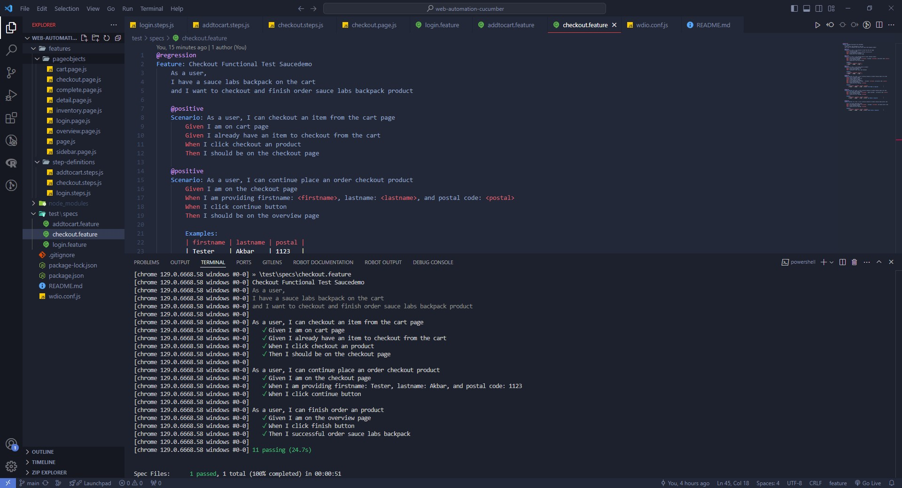

# Functional Web Automation Testing Using WebdriverIO and Cucumber on Saucedemo

Repository for Learning Software Quality Assurance - Web Automation Using WebdriverIO with Cucumber

    

This is a personal project focused on practicing functional web automation testing on the Saucedemo website using WebdriverIO with Cucumber. The goal of this project is to enhance skills in End-to-End (E2E) testing, covering critical user workflows such as login, adding a product to the cart, accessing the cart page, and completing the checkout process. The project leverages **Cucumber** for structuring the test scenarios in Gherkin syntax, **spec-reporter** for clear and readable test reporting, and **chromedriver** to run the tests in the Chrome browser.

## 🚀 Project Overview

The project scenarios include:

- **Login.feature**: Automate scenario of the login process with valid user credentials and the negative flow.
- **Add to Cart**: Automate scenario of add product to the shopping cart.
- **Checkout**: Scenario of Completing the checkout process, which includes entering user information, validating the order summary, and finish an order.

## Screenshot of Order Suite Report

## 📌 Current Status

The functional testing project has been running as expected.

## 🛠️ Tools Used

- **WebdriverIO**: A powerful test automation framework used to create and execute test cases.
- **Cucumber Framework**: The test framework used to write scenarios in Gherkin syntax.
- **Spec Reporter**: A WebdriverIO plugin to report in spec style.
- **ChromeDriver**: The tests are executed using the Chrome browser.
- **Saucedemo by Swag Labs**: The target website used for practicing web automation testing scenarios.

## 📈 Goals

- Enhance web automation skills using WebdriverIO with Cucumber.
- Improve understanding of testing processes and best practices.
- Develop modular test cases to handle various user interactions and scenarios effectively.

## 🔗 Resources

- **Saucedemo by Swag Labs**: [Visit Website](https://www.saucedemo.com/)

## 🙏 Acknowledgements

Thank you for taking the time to explore this project! I appreciate any feedback, contributions, or suggestions to help me grow and improve my skills.

Feel free to reach out, and happy testing!
